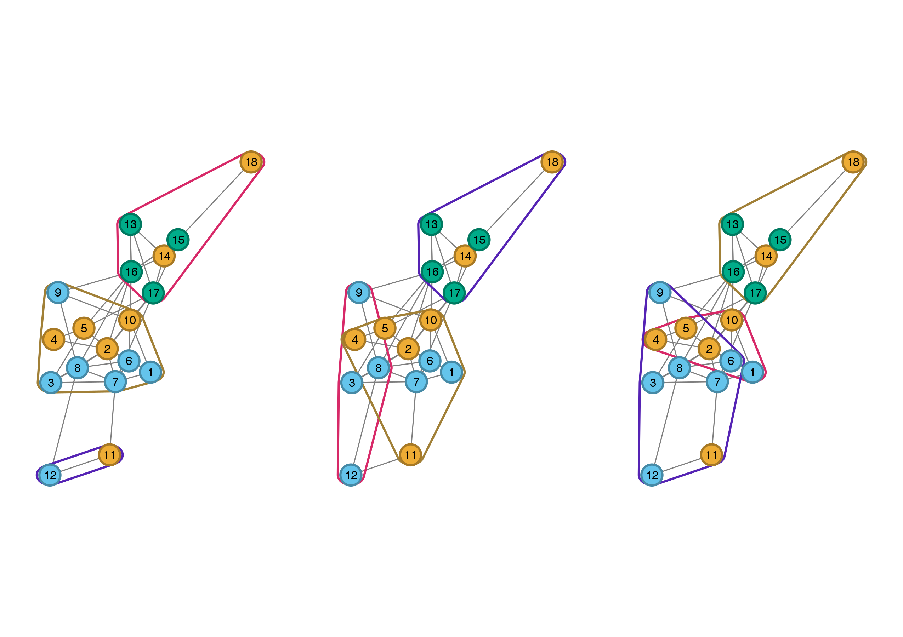

# monitoringOutcomes (DOI: 2 be added)

## Overview

R functions for analysis of stakeholder perceptions of desirable monitoring outcomes.
The following scripts relate to the following figures.

- **Fig 1**: `dartdiag.R`
- **Fig 2a-b**: `walktrapdendro4.R`
- **Fig 2c**: `edge_clustering.R`
- **Fig 3**: `connectivity2a.R`
- **Fig S1**: `3netscomp2a.R`

Sets of links and nodes are required to creates figures. They are
included in the `data` folder; three version are furnished. See the `How to` section
to reproduce the figures of the manuscript.

Orientation of networks may differ on each run due to random placement of the
first node during plotting to avoid such behavior, use `set.seed()` with
a specific values (see below).


## An R package?

We have used a standard R package to:

1. efficiently assess the quality of our code (here we simply used `R CMD check`);

2. readily share our code (see installation section below).

We however acknowledge that despite the form of a standard R package, the code
presented is more a organized script than a package (*i.e.* functions included
are not general).


## How to

### Figure 1

```R
set.seed(1987)
data(nodes)
data(links)
png("inst/fig/fig1.png", width=8, height=10, units="in", res=300)
  dartdiag(nodes, links)
dev.off()
```


### Figure 2 a and b

```R
set.seed(3466)
data(nodes2)
data(links2)
png("inst/fig/fig2ab.png", units="in", res=300, width=8.5, heigh=6)
  walktrap_dendro(links2, nodes2)
dev.off()
```


### Figure 2c

```R
set.seed(3466)
data(nodes3)
data(links3)
png("inst/fig/fig2c.png", units="in", res=300, width=8.5, heigh=6)
  connectivity2a(links3, nodes3)
dev.off()
```


### Figure 3

```R
set.seed(102)
data(nodes2)
data(links2)
png("inst/fig/fig3.png", units="in", res=300, width=8.5, heigh=6)
  edge_clustering(links2, nodes2)
dev.off()
```


### Figure S1

```R
set.seed(889)
data(nodes2)
data(links2)
png("inst/fig/figS1.png", units="in", res=300, width=8.5, heigh=6)
  netcomp2a(links2, nodes2)
dev.off()
```


