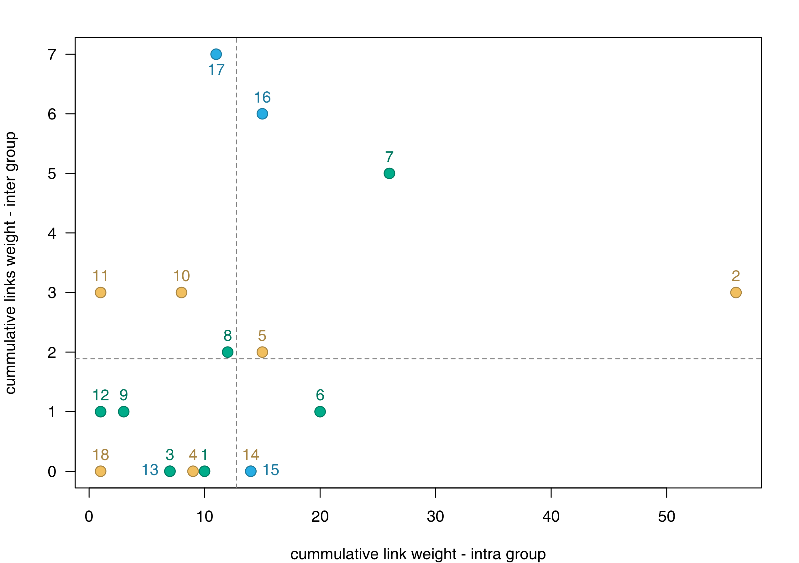
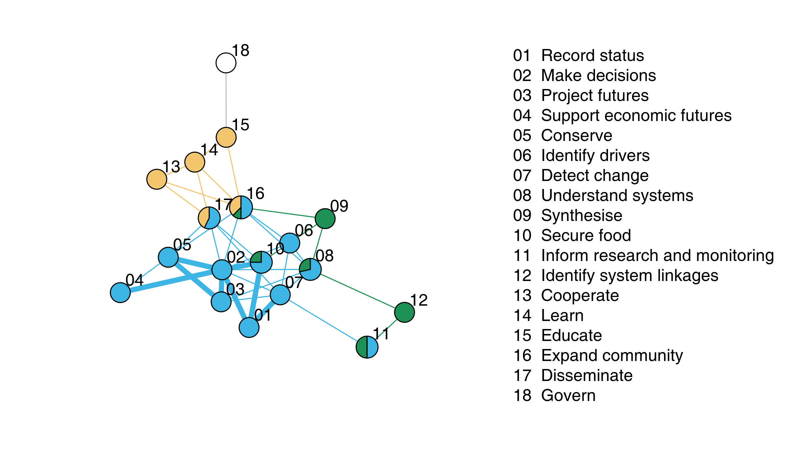

# monitoringOutcomes


## Overview

R functions for analysis of stakeholder perceptions of desirable monitoring outcomes.
The following R functions (see `R/`) relate to the following figures.

- **Fig 1**: `dartdiag.R`
- **Fig 2a-b**: `walktrapdendro4.R`
- **Fig 2c**: `edge_clustering.R`
- **Fig 3**: `connectivity2a.R`
- **Fig S3**: `3netscomp2a.R`

The sets of links and nodes required to create the figures are included in the
`data` folder (basically the data associated with the paper); three versions
are furnished. See the [How to](#how-to) section to reproduce the figures of
the manuscript. Note that for some figures, the nodes coordinates are randomized
to avoid such behavior, we used `set.seed()` below.


## An R package?

We have used a standard R package to:

1. efficiently assess the quality of our code (here we simply used `R CMD check`);

2. readily share our code.

We however acknowledge that despite the form of a standard R package, the code
presented is more a organized script than a package (*i.e.* functions included
are not general).

To install this package, one very convenient way is to use [`devtools`](https://cran.r-project.org/web/packages/devtools/index.html).
Note that one of the packages required, `graphicsutils`, is not available on
the CRAN, so it should be installed with `devtools` too. So one way to
install this package is to type the following line in your R console:

```R
install.packages("devtools")
devtools::install_github("inSileco/graphicsutils")
devtools::install_github("KevCaz/monitoringOutcomes")
```


## How to

Before calling any function, load the package:

```R
devtools::load_all()
```

### Figure 1


```R
library(Cairo)
vec_col <-  c("#f1bf5f", "#058544", "#27ade3")
data(nodes)
data(links)

## PNG
png("inst/fig/fig1.png", width=8, height=10, units="in", res=300)
  dartdiag(nodes, links, vec_col)
dev.off()

## SVG
CairoSVG("inst/fig/fig1.svg", width=8, height=10)
  dartdiag(nodes, links, vec_col)
dev.off()
```


### Figure 2 a and b

```R
data(nodes2)
data(links2)

## PNG
set.seed(3466)
png("inst/fig/fig2ab.png", units="in", res=300, width=8.5, heigh=6)
  walktrap_dendro(links2, nodes2, vec_col)
dev.off()

## SVG
set.seed(3466)
CairoSVG("inst/fig/fig2ab.svg", width=8.5, heigh=6)
  walktrap_dendro(links2, nodes2, vec_col)
dev.off()
```


### Figure 2c

```R
data(nodes3)
data(links3)
## PNG
png("inst/fig/fig2c.png", units="in", res=300, width=8.5, heigh=6)
  connectivity2a(links3, nodes3,  cex_crl = 1.5)
dev.off()

## SVG
CairoSVG("inst/fig/fig2c.svg", width = 8.5, height = 6)
  connectivity2a(links3, nodes3, vec_col, cex_crl = 1.5)
dev.off()
```




### Figure 3

```R
set.seed(2)
data(links2)
data(nodes2)
vec_names <- sort(gsub(paste0(nodes2[,1L], "  ", nodes2[,2L]), pattern= "^n", replacement = ""))
png("inst/fig/fig3.png", units = "in", res = 300, width = 8,  height = 4.5)
  edge_clustering(links2, vec_names, vec_col)
dev.off()

## SVG
set.seed(2)
CairoSVG("inst/fig/fig3.svg",  width = 8, height = 4.5)
  edge_clustering(links2, vec_names, vec_col)
dev.off()
```




### Figure S3

```R
set.seed(81932)
data(nodes2)
data(links2)
png("inst/fig/figS3.png", units="in", res=300, width = 8, height = 5)
  netcomp2a(links2, nodes2, vec_col)
dev.off()

## SVG
set.seed(81932)
CairoSVG("inst/fig/figS3.svg", width = 8, height =  5)
  netcomp2a(links2, nodes2, vec_col)
dev.off()
```


